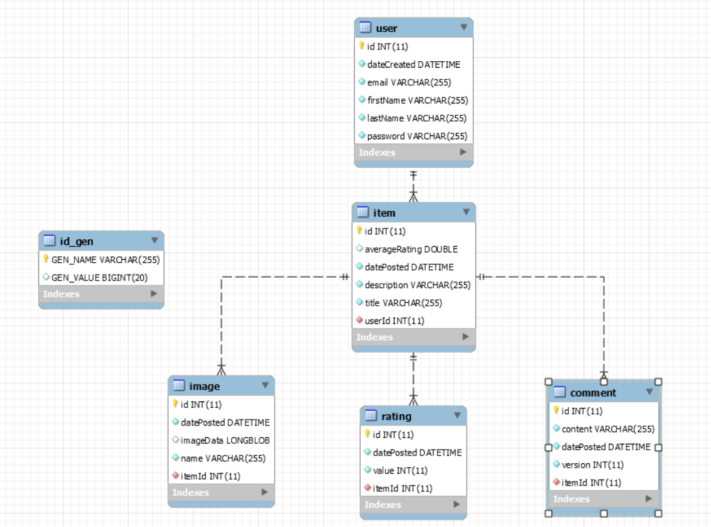

# SpringBoot and MySQL database application.

# Database structure.

# SQL Scripts.

# Useful info
Get a bean from contex in run time phase.
1. Inject an (ApplicationContext applicationContex) bean in your class in order to get bean.
BeanDefinition beanDefinition =
((AnnotationConfigServletWebServerApplicationContext) applicationContext).getBeanDefinition("beanName");
